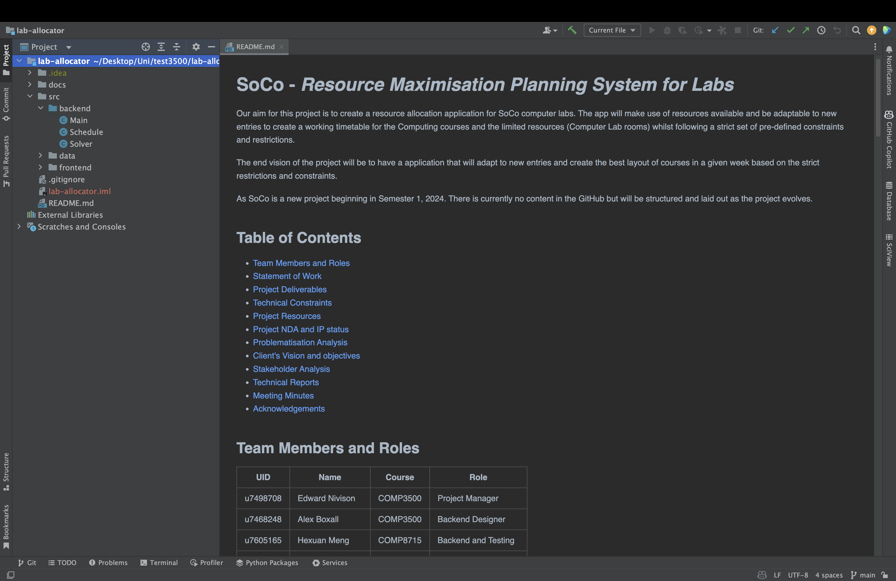

# Backend Setup and Install

Basic information:
- Java project without external build system (at least for now)
- IntelliJ for IDE (although others could work)
- OpenJDK 21.0.2, language level 20

Steps:

- Download the repository by running:`git clone https://github.com/mazfil/lab-allocator.git`
- Open IntelliJ (tested on version 2023.1.3 Ultimate, but other versions should work fine)
- Open the top-level `lab-allocator` folder
- You should see something like this: 
- For doing backend development, ensure the backend folder is marked as the sources root. You can do this by right clicking on the src/backend folder, going to Mark Directory As, and then Sources Folder: 
  - (if you see the option "Unmark as sources root" then this step has already been done and so you can skip it)
- Select OpenJDK 21, and Java version 20. You may need to download the JDK from here: https://www.oracle.com/au/java/technologies/downloads/ 
  - (other versions may work too, but for consistency we should stick to this version)
- Open the Edit Configurations... menu 
- Add a new Application configuration 
- Set the JDK version to 21, and select the Main class (in the default package) as the main file 
- Click OK
- Can now click on the Run button to start the program 
- Currently (10 March 2024) you should see the following terminal output 